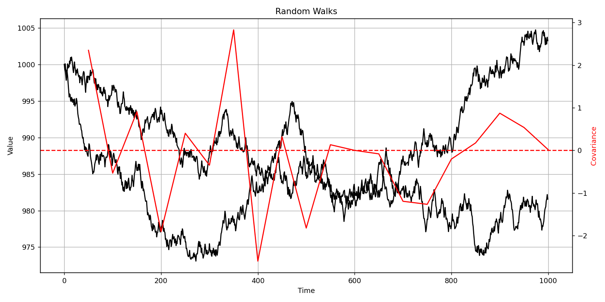
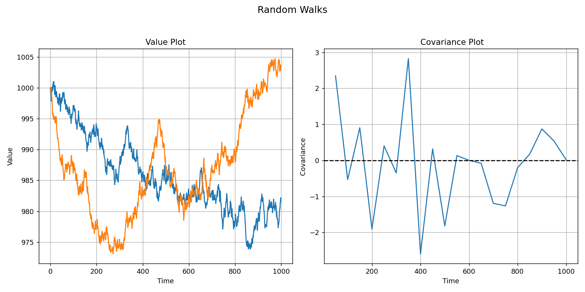

# Random Walk - Covariance

This repo tests some previous things I've been working on. Namely trying to combine some of the HPC (hi-perf computing with BLAS) techniques and visualization methods (plot-cpp).

The code in main.cpp produces two plots showing the covariance between two sets of randomly generated time-series data.

Overall, I'm pretty satisfied with the interface for plot-cpp. Of course it's not as simple as just using Python, but it's not an excessively convoluted process either.

## Dependencies

- CMake
- g++ (or equivalent compiler)
- plot-cpp (https://github.com/josh-orio/plot-cpp)
- Python3
- Matplotlib